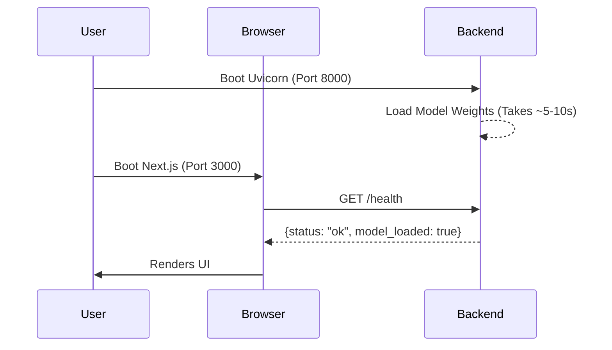

# Quick Start

## Overview

Two ways to start: the **one-command launcher** (recommended) or the **manual backend + frontend** flow. If you only want a quick look, the home page can run **browser GPT-2** with no servers at all. This guide walks you through the options and verifying they work.

## Why it matters

The full experience — attention, interventions, model inventory, GGUF drop-in — requires the backend to stream traces. If the backend isn't booted correctly, or is on the wrong port, the UI will display connection errors. For the quickstart look, the in-browser GPT-2 path needs nothing besides a modern browser.

## How TokenPrint implements it

TokenPrint defaults to local development ports:
- **Backend:** `http://localhost:8000` (uvicorn)
- **Frontend:** `http://localhost:3000` (next dev)

The frontend makes CORS-restricted calls directly to the backend port.

## Option A — One-command launcher

```bash
python3 scripts/start.py   # Python 3.11/3.12 and Node 20.9+
```

The launcher installs dependencies, downloads the model with progress, and checks both services. For an immediate offline example, choose **Try a recorded demo** on the home page.

## Option B — Manual servers (two terminal windows)

### Terminal 1: Backend
The backend will automatically download the default Qwen model (`Qwen/Qwen2.5-0.5B-Instruct`) from HuggingFace on its first run. This requires an internet connection and will download roughly 1GB of data.

```bash
cd backend
source .venv/bin/activate
# Start the FastAPI server
python -m uvicorn app.main:app --app-dir . --port 8000
```
*Wait until you see `Application startup complete.`*

### Terminal 2: Frontend
```bash
cd frontend
# Start the Next.js development server
npm run dev
```

## Option C — Browser-only (no servers)

Open the deployed site (GitHub Pages) and pick **Browser GPT-2** from the generation source (WebGPU preferred, CPU/WASM fallback). Greedy decoding only, max 32 new tokens, ~500 MB one-time download cached by the browser. Attention, interventions, and GGUF need the Python backend.

## Verifying the Setup

Open your web browser and navigate to:
**[http://localhost:3000](http://localhost:3000)**

You should see the TokenPrint UI. Look at the Top Bar; it should display the model status as **"Ready"** and indicate the active device (e.g., `mps`, `cuda`, or `cpu`). With browser GPT-2 selected, the model badge instead reads **BROWSER · WEBGPU · GPT-2**.

> **Warning**
> If the UI shows a "Disconnected" error, verify that the backend is running on exactly port `8000` and that your browser is allowing local CORS requests.

## Diagram



## Related pages
- [Installation](Getting-Started-Installation)
- [Running your first visualization](Getting-Started-Running-your-first-visualization)

## Further reading
- [API Reference](API-Reference)
- [Deployment Docs](../docs/deployment.md)

## Navigation
| Previous | Home | Next |
| --- | --- | --- |
| [Installation](Getting-Started-Installation) | [Home](Home) | [Running your first visualization](Getting-Started-Running-your-first-visualization) |
