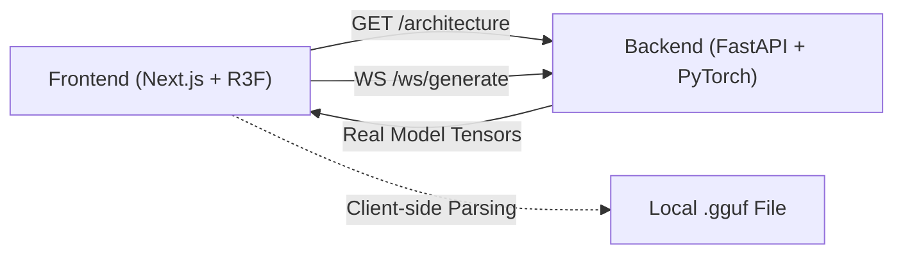

# TokenPrint

TokenPrint is an interactive 3D visualization platform for exploring transformer architectures, tensors, and real-time LLM inference. 

  

## Overview

TokenPrint is a browser-based 3D inspector for the internals of language models. It bridges the gap between abstract educational diagrams and raw tensor dumps by rendering **real data**—parsed straight from a model file or produced by an actual forward pass. Nothing you see in TokenPrint is illustrative, sampled from noise, or hardcoded. If a number appears, it comes from a real tensor, metadata record, or forward pass.

## Mission

Our mission is to enable anyone—from first-time learners grasping the concept of self-attention to inference engineers optimizing low-level operations—to observe how a Transformer Layer evolves across tokens and time in a mathematically honest, intuitively visual way.

## Philosophy

- **Real data over decorative simulation:** We never fabricate intermediate values. If the data is missing, we show it as missing.
- **Architecture-faithful visuals over generic diagrams:** The 3D geometry scales precisely with the real parameters of the loaded model.
- **Explainability for beginners, depth for researchers:** Hover for intuitive explanations, click for raw tensor dumps and shape information.
- **Fast local workflows for contributors:** Designed to run purely locally, ensuring model privacy and rapid iteration.

## Why TokenPrint exists

The deep learning community suffers from a visualization gap. We have excellent static diagrams for beginners (like *The Illustrated Transformer*) and powerful low-level debugging tools (like `netron` or `torch.Tensor.size()`), but nothing connects the two. TokenPrint exists to show you exactly how a model executes mathematically while presenting it visually, allowing you to literally *see* a language model think.

## Key Features

| Feature | Description |
| ------- | ----------- |
| **Architecture Explorer** | A 3D point cloud of every real tensor, searchable and categorized, backed by real parameter counts. |
| **Live Inference** | Token-by-token streamed generation rendering per-operation geometry (e.g., one blade per attention head). |
| **Tensor Inspector** | Hover and click to inspect shapes, dtypes, and exact weight slices. |
| **Data-Driven Geometry** | A SwiGLU funnel is sized exactly by the real FFN ratio; attention heads are clustered for GQA. |
| **Local GGUF Parsing** | Drag and drop multi-GB `.gguf` files; parsing happens instantly in the browser without uploading. |

## Quick Links

- [Installation](Getting-Started-Installation)
- [Quick Start](Getting-Started-Quick-Start)
- [Architecture Explorer](User-Guide-Architecture-Explorer)
- [Overall Architecture](Architecture-Overall-Architecture)
- [REST API](API-Reference-REST-API)

## Navigation

| Section | Description |
| ------- | ----------- |
| **[Getting Started](Getting-Started)** | Installation, quick start, and running your first visualization. |
| **[User Guide](User-Guide)** | How to use the Architecture Explorer, Live Inference, and HUD. |
| **[Transformer Concepts](Transformer-Concepts)** | Deep dives into Tokenization, KV Cache, RoPE, and more. |
| **[Supported Models](Supported-Models)** | Details on Llama, Qwen, GGUF formats, and more. |
| **[Visualization System](Visualization-System)** | The Three.js scene graph, geometry, and color mapping. |
| **[Architecture](Architecture)** | Frontend/Backend separation, WebSocket protocol, and data pipelines. |
| **[Developer Guide](Developer-Guide)** | Building from source, debugging, and adding new features. |
| **[API Reference](API-Reference)** | REST endpoints, WebSocket streams, and internal schemas. |
| **[Research](Research)** | Scientific accuracy, design philosophy, and related papers. |

> **Note**
> All documentation uses consistent terminology like **Transformer Layer**, **KV Cache**, and **Live Inference**.

> **Tip**
> If you are new to transformers, read [Transformer Concepts](Transformer-Concepts) alongside the [User Guide](User-Guide).

## Diagram

## Related pages
- [Getting Started](Getting-Started)
- [Architecture](Architecture)
- [Transformer Concepts](Transformer-Concepts)

## Further reading
- [Project README](../README.md)

## Navigation
| Previous | Home | Next |
| --- | --- | --- |
| None | [Home](Home) | [Getting Started](Getting-Started) |
